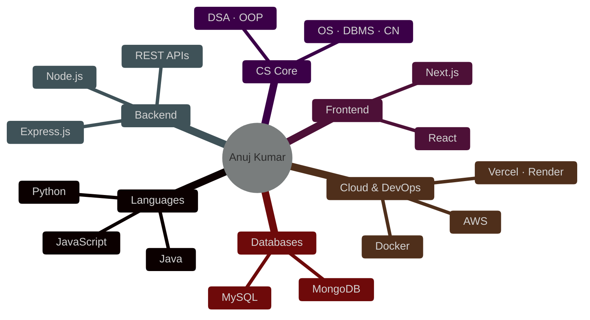
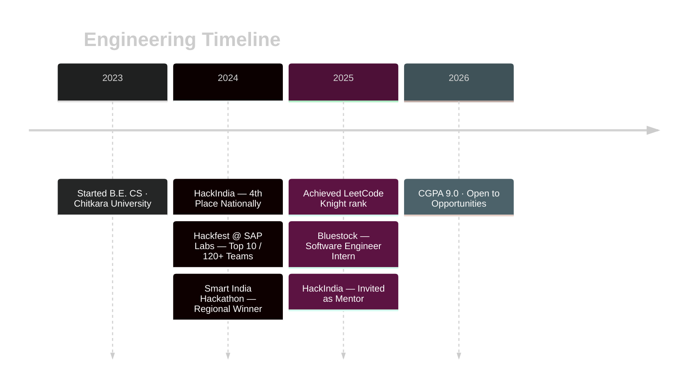

<div align="center">

```
╔══════════════════════════════════════════════════════════════╗
║                                                              ║
║        const dev = new Engineer("Anuj Kumar");               ║
║        dev.role    = "Full-Stack · Cloud · AI";              ║
║        dev.status  = "open to opportunities";                ║
║        dev.cgpa    = 9.0;                                    ║
║                                                              ║
╚══════════════════════════════════════════════════════════════╝
```


<br/>

[](https://anujer.is-a.dev)
&nbsp;
[](https://linkedin.com/in/anuj-er)
&nbsp;
[](https://x.com/5iwach)
&nbsp;
[](mailto:anujkumar142000@gmail.com)
&nbsp;
[](https://github.com/anuj-er)

</div>

---

<table width="100%">
<tr>
<td valign="top" width="50%">

### Identity

```yaml
name    : Anuj Kumar
degree  : B.E. Computer Science
college : Chitkara University, Punjab
cgpa    : 9.0 / 10
batch   : 2023 – 2027
```

</td>
<td valign="top" width="50%">

### Experience

```yaml
role    : Software Engineer Intern
company : Bluestock
period  : Nov 2025 – Dec 2025
scope   : backend · frontend · git · releases
```

</td>
</tr>
</table>

---

### Stack



---

### Competitive Programming

```
Platform  :  LeetCode
Rank      :  Knight  ⚔️
Topics    :  Arrays · Hashing · Recursion · Greedy · Trees · DP
```

<div align="center">
  
</div>

---

### Wins

| Event | Result |
|---|---|
| **Hackfest @ SAP Labs** | 🥇 Regional Winner &nbsp;·&nbsp; Top 10 out of 120+ teams |
| **Smart India Hackathon** | 🥇 Regional Winner &nbsp;·&nbsp; Selected for national platform |
| **HackIndia 2024** &nbsp;_(India's Largest Web3 & AI Hackathon)_ | 🏅 4th Place Nationally &nbsp;·&nbsp; Invited as Mentor 2025 |

---

### Journey



---

<div align="center">
  
</div>

<br/>

<div align="center">
  
</div>

<br/>

<div align="center">
  <sub>built with focus · shipped with intent</sub>
</div>
